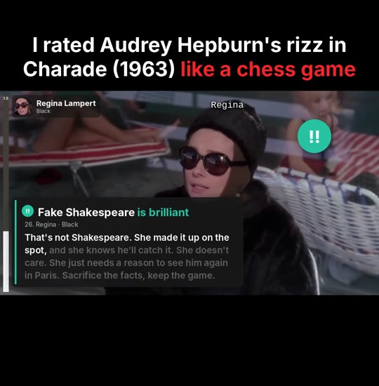

# Chess Rater



Makes **"I rated ___ like a chess game"** videos for TikTok and Instagram Reels. You give it
a movie or TV clip and a list of "moves" (who said what, how good it was, and a line of
commentary). It renders a finished 1080×1920 MP4 with:

- the hook title above the clip, with the red "like a chess game" accent
- chess.com-style player tags (White at the bottom, Black at the top) and a live eval bar
- name labels over each character, shot by shot
- move badges (`!!` brilliant, `!` great, ★ best, 👍 excellent, ✓ good, 📖 book, `?!`, `?`, ✕, `??`)
- freeze frames with a commentary card, read aloud by an AI voice while the words light up
- a cold-open hook that teases the big move, then rewinds to the start
- a closing **Game Review** with accuracy scores, move counts and the result

Everything runs locally and needs no paid services. The voice-over uses
[Kokoro](https://github.com/thewh1teagle/kokoro-onnx), a free text-to-speech model.

## Setup (once)

1. Install [ffmpeg](https://ffmpeg.org/download.html) and Python 3.10+.
2. In this folder:

   ```sh
   pip install -r requirements.txt
   ```

The first render downloads the voice model (about 340 MB) into `models/`.

## Render the demo

The demo uses the ski-lodge scene from *Charade* (1963), which is in the US public domain.
Fetch the clip (about 50 MB), then render:

```sh
mkdir -p clips
ffmpeg -ss 180 -i "https://archive.org/download/charade-1963-cary-grant-audrey-hepburn-walter-matthau-1080p-reup/Charade%20%281963%29%20Cary%20Grant%2C%20Audrey%20Hepburn%2C%20Walter%20Matthau%2C%20James%20Coburn%2C%20George%20Kennedy%3B%201080p%5D.ia.mp4" \
  -t 280 -c copy -avoid_negative_ts make_zero clips/charade-lodge.mp4

python chessrate.py projects/charade.json        # -> out/charade.mp4
```

## Making a new video

1. **Pick a scene.** The best ones are 1–3 minutes of back-and-forth between two sides: a
   negotiation, an interview, an argument, a flirt or a bluff. Someone should clearly "win".
2. **Scout it.** `python scout.py clips/scene.mp4 --from 120 --to 250` writes a transcript
   with timestamps and a contact sheet of every shot with a 10×10 grid. The transcript needs
   `pip install faster-whisper`. Use the sheet to read off x/y positions for labels and badges.
3. **Write the project file.** Copy `projects/charade.json` and edit it (format below).
   Five or six voiced cards plus 20–30 quick badges is about right for 2–3 minutes.
4. **Check it.**
   - `python chessrate.py projects/scene.json --timeline` prints the edit and where every
     move lands.
   - `--preview 12,40.5,88` writes PNG stills to `out/preview/`.
   - `--range 30:60` renders only part of the video.
   - `--no-voice` skips the voice-over for quick drafts.
5. **Render.** `python chessrate.py projects/scene.json` writes `out/scene.mp4`.

## Project file

All times are in seconds **of the source clip**. (The comments below are only there to
explain the fields; real JSON files can't contain them.) Positions (`x`, `y`, `badge`) are fractions
of the video frame: `0,0` is top-left and `1,1` is bottom-right.

```jsonc
{
  "source": "../clips/scene.mp4",
  "title": {"text": "I rated Mike Ross's job interview", "accent": "like a chess game"},
  "voice": "af_heart",            // Kokoro voice: af_heart, af_bella, am_michael, am_puck, bm_george, ...
  "speed": 1.05,
  "crop": "auto",                 // trims letterbox bars; or [w, h, x, y]; or false
  "players": {
    "white": {"name": "Mike Ross", "short": "Mike",
              "avatar": {"t": 151.0, "x": 0.47, "y": 0.27, "size": 0.4}},  // face crop from the clip
    "black": {"name": "Harvey Specter", "short": "Harvey", "avatar": "harvey.png"}  // or an image file
  },
  "hook": {                       // optional cold open: plays up to a card move, then rewinds
    "from": 226.6,
    "move": "Fake Shakespeare",   // name of a move that has a "comment"
    "vo": "He just blundered. So how did he still get the job? Let's start from the beginning."
  },
  "segments": [[137.5, 165.45], [182.6, 248.9]],   // the parts of the clip to use, in order
  "review": {"at": 248.0, "result": "1-0 · Mike gets the job", "vo": "White wins."},
  "labels": [[137.0, 139.15, "Regina", 0.55, 0.07]],  // [from, to, text, x, y]
  "moves": [
    // a quick badge: shows for ~3 s while the clip keeps playing
    {"t": 143.0, "side": "black", "class": "good", "name": "Bank Robber",
     "note": "Answers with a joke.", "eval": 0.2, "badge": [0.82, 0.22]},
    // a card: freezes the clip, and the voice reads "comment" (or "vo" if given)
    {"t": 157.05, "side": "black", "class": "best", "name": "The Waitlist",
     "comment": "She doesn't say no. She says not yet. ...", "eval": -1.6,
     "badge": [0.83, 0.24], "card": "left"}
  ]
}
```

- **`class`** is one of `brilliant`, `great`, `best`, `excellent`, `good`, `book`,
  `inaccuracy`, `mistake`, `miss`, `blunder`. Accuracy in the Game Review is worked out from
  these. You can override it with `"review": {"accuracy": {"white": 91.2, "black": 78.0}}`.
- **`eval`** is the evaluation *after* the move: positive favours White, negative favours
  Black. Use `"1-0"` or `"0-1"` for checkmate. Moves without `eval` leave the bar where it is.
- **`t`** for a card should sit just after the line ends and before the next shot cut, so
  the freeze lands on the right face. The scout transcript gives the end time of every word.
- **`card`** is `"right"` (the default) or `"left"`. Cards sit along the bottom of the clip, and
  a left card briefly hides the bottom player tag. Pick the side that keeps faces visible.
- **Timing**: the freeze lasts as long as the voice-over, so keep each comment to about
  25–40 words.

## Posting

- The output is 1080×1920, 30 fps, H.264 + AAC with loudness normalised to −14 LUFS. It
  uploads straight to TikTok, Reels and Shorts.
- Cards and badges keep clear of the right-hand like/comment/share buttons.
- The hook matters most: open on the most surprising move, and make the title name someone
  people know.
- **Copyright:** films and shows under copyright can get muted, taken down or earn strikes,
  even with commentary over them. Public-domain films are safe (for example *Charade*,
  *His Girl Friday*, *Night of the Living Dead*, *Detour* and *D.O.A.*), as is footage you
  have rights to.
